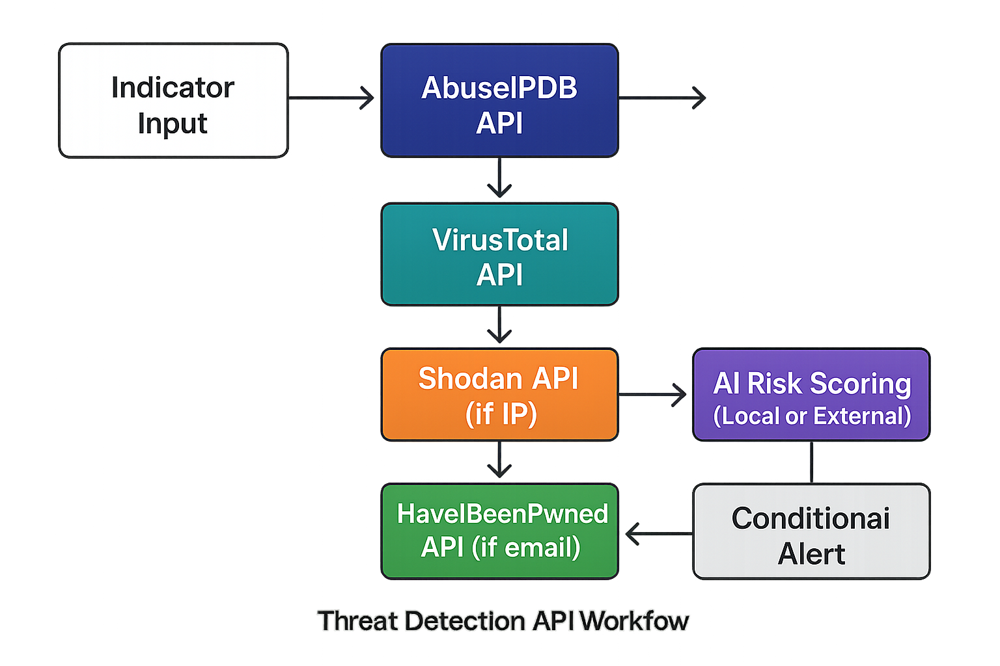

# Threat Detection Postman Notebook

## Overview
A fully automated Threat Intelligence Notebook using Postman.  
Chained API lookups: AbuseIPDB → VirusTotal → Shodan → HIBP → AI Risk Scoring → Conditional Alert → Reports.

## Setup
1. Import `environment.json` → set keys: `VT_API_KEY`, `ABUSEIPDB_KEY`, `SHODAN_KEY`, `HIBP_KEY`.  
2. Import `collection.json` into Postman → select `ThreatDetection_Env`.  
3. Open **Router (Start Here)** → run for a single indicator or use Runner with `sample_indicators.csv` for bulk mode.  

## GitHub Integration
- Commits include `collection.json` + `environment.json` for easy reuse.  
- Newman + GitHub Actions auto-run tests on push.  
- If `ai_risk_score > 70`, a GitHub Issue is automatically created and labeled **High-Risk Threat**.  
- Reports stored in `/reports` for review or dashboards.  

## API Flow Diagram

## Impact
Low-cost, lightweight SOC workflow suitable for students and security teams without enterprise SIEM tools.
